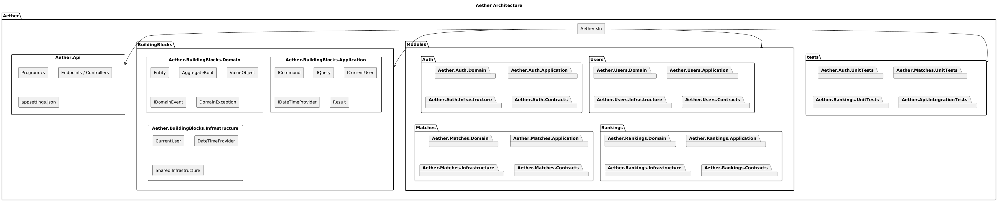

# aether-apps
Contains Aether Apps

- **Aether** — .NET backend
- **To be decided** — Flutter mobile app

## Aether Architecture (WiP)

The backend follows a modular monolith architecture with separated modules for Auth, Users, Matches, and Rankings.

